# goit-rdb-hw-04

**#1.1**

```
CREATE SCHEMA LibraryManagement;
```

<details>
  <summary>Screenshot</summary>

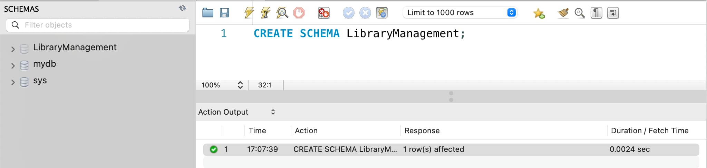

</details>

**#1.2**

```
CREATE TABLE genres (
    genre_id INT AUTO_INCREMENT PRIMARY KEY,
    genre_name VARCHAR(255)
);
```

<details>
  <summary>Screenshot</summary>

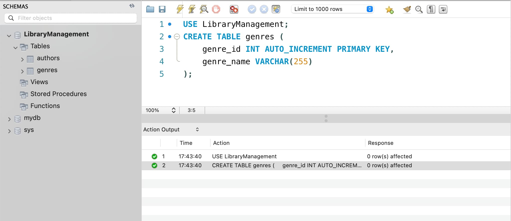

</details>
<br/>

**#1.3**

```
CREATE TABLE authors (
    author_id INT AUTO_INCREMENT PRIMARY KEY,
    author_name VARCHAR(255)
);
```

<details>
  <summary>Screenshot</summary>


</details>
<br/>

**#1.4**

```
CREATE TABLE books (
    book_id INT AUTO_INCREMENT PRIMARY KEY,
    title VARCHAR(255),
    publication_year YEAR,
    author_id INT,
    genre_id INT,
    FOREIGN KEY (author_id) REFERENCES authors(author_id),
    FOREIGN KEY (genre_id) REFERENCES genres(genre_id)
);
```

<details>
  <summary>Screenshot</summary>

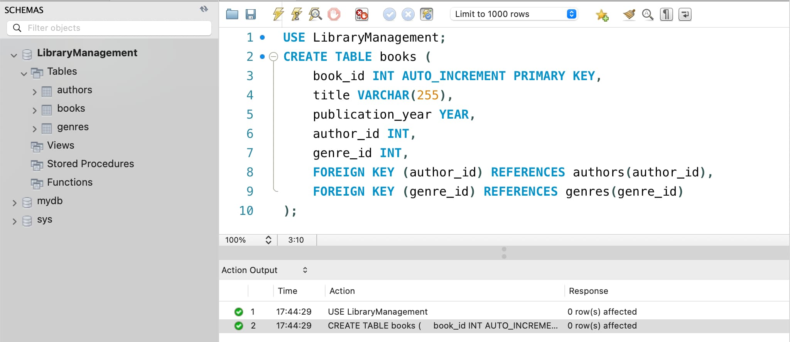

</details>
<br/>

**#1.5**

```
CREATE TABLE users (
    user_id INT AUTO_INCREMENT PRIMARY KEY,
    username VARCHAR(255),
    email VARCHAR(255)
);
```

<details>
  <summary>Screenshot</summary>

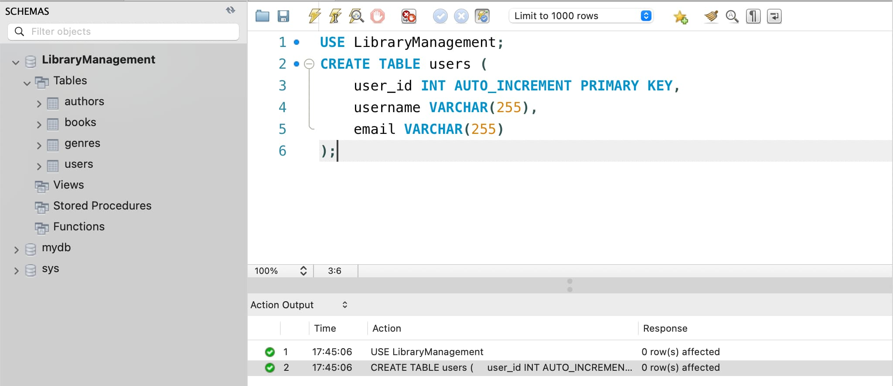

</details>
<br/>

**#1.6**

```
CREATE TABLE borrowed_books (
    borrow_id INT AUTO_INCREMENT PRIMARY KEY,
    book_id INT,
    user_id INT,
    borrow_date DATE,
    return_date DATE,
    FOREIGN KEY (book_id) REFERENCES books(book_id),
    FOREIGN KEY (user_id) REFERENCES users(user_id)
);
```

<details>
  <summary>Screenshot</summary>

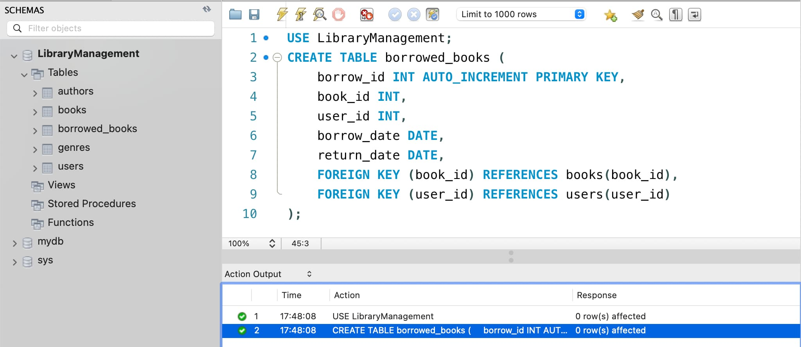

</details>
<br/>

---

**#2**

```
INSERT INTO genres (genre_name) VALUES ('fantasy');
INSERT INTO authors (author_name) VALUES ('Robert Jordan');
INSERT INTO books (title, publication_year, author_id, genre_id)
        VALUES ('The Eye of the World', 1990, 1, 1);
INSERT INTO users (username, email)
        VALUES ('foo_baz', 'baz@example.com');
INSERT INTO borrowed_books (book_id, user_id, borrow_date, return_date)
        VALUES (1, 1, '2024-10-05', '2024-10-15');
```

<details>
  <summary>Screenshot</summary>

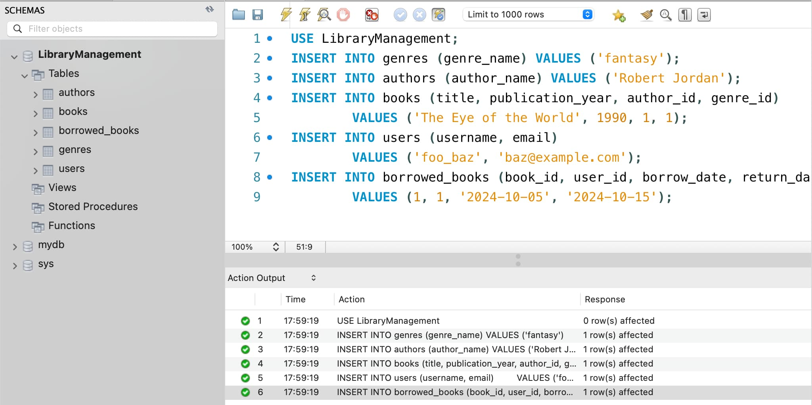

</details>
<br/>

---

**#3**

```
SELECT  orders.id AS order_id,
    customers.name AS customer_name,
    shippers.name AS shipper_name,
    suppliers.name AS supplier_name,
    products.name AS product_name,
    categories.name AS category_name,
    order_details.quantity,
    products.price,
    products.unit,
    orders.date AS order_date
FROM orders
INNER JOIN order_details ON orders.id = order_details.order_id
INNER JOIN customers ON orders.customer_id = customers.id
INNER JOIN shippers ON orders.shipper_id = shippers.id
INNER JOIN products ON order_details.product_id = products.id
INNER JOIN suppliers ON products.supplier_id = suppliers.id
INNER JOIN categories ON products.category_id = categories.id;
```

<details>
  <summary>Screenshot</summary>

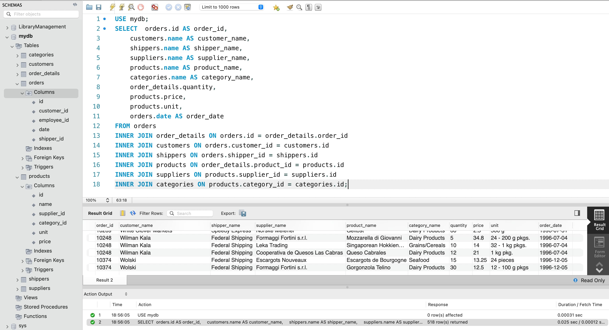

</details>
<br/>

---

**#4.1**

```
SELECT COUNT(orders.id) AS total_rows
FROM orders
INNER JOIN order_details ON orders.id = order_details.order_id
INNER JOIN customers ON orders.customer_id = customers.id
INNER JOIN shippers ON orders.shipper_id = shippers.id
INNER JOIN products ON order_details.product_id = products.id
INNER JOIN suppliers ON products.supplier_id = suppliers.id
INNER JOIN categories ON products.category_id = categories.id;
```

<details>
  <summary>Screenshot</summary>

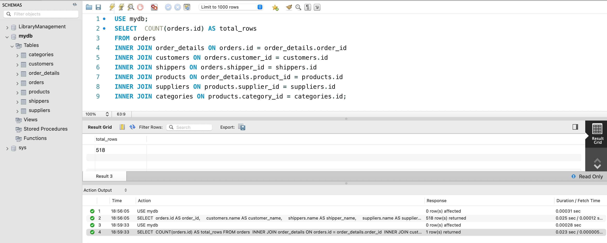

</details>
<br/>

**#4.1**

```
SELECT COUNT(orders.id) AS total_rows
FROM orders
INNER JOIN order_details ON orders.id = order_details.order_id
INNER JOIN customers ON orders.customer_id = customers.id
INNER JOIN shippers ON orders.shipper_id = shippers.id
INNER JOIN products ON order_details.product_id = products.id
INNER JOIN suppliers ON products.supplier_id = suppliers.id
INNER JOIN categories ON products.category_id = categories.id;
```

<details>
  <summary>Screenshot</summary>


</details>
<br/>

**#4.2**

```
SELECT COUNT(orders.id) AS total_rows
FROM orders
INNER JOIN order_details ON orders.id = order_details.order_id
LEFT JOIN customers ON orders.customer_id = customers.id
RIGHT JOIN shippers ON orders.shipper_id = shippers.id
INNER JOIN products ON order_details.product_id = products.id
RIGHT JOIN suppliers ON products.supplier_id = suppliers.id
INNER JOIN categories ON products.category_id = categories.id;
```

<details>
  <summary>Screenshot</summary>

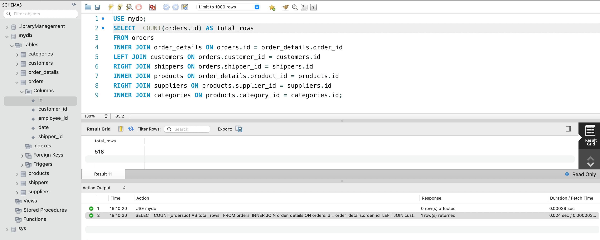

</details>
* немає NULL значень при використанні LEFT або RIGHT JOIN
 - всі записи між таблицями мають відповідності
<br/>

**#4.3**

```
SELECT COUNT(orders.id) AS total_rows
FROM orders
INNER JOIN order_details ON orders.id = order_details.order_id
INNER JOIN customers ON orders.customer_id = customers.id
INNER JOIN shippers ON orders.shipper_id = shippers.id
INNER JOIN products ON order_details.product_id = products.id
INNER JOIN suppliers ON products.supplier_id = suppliers.id
INNER JOIN categories ON products.category_id = categories.id
WHERE orders.employee_id > 3 AND orders.employee_id <= 10;
```

<details>
  <summary>Screenshot</summary>

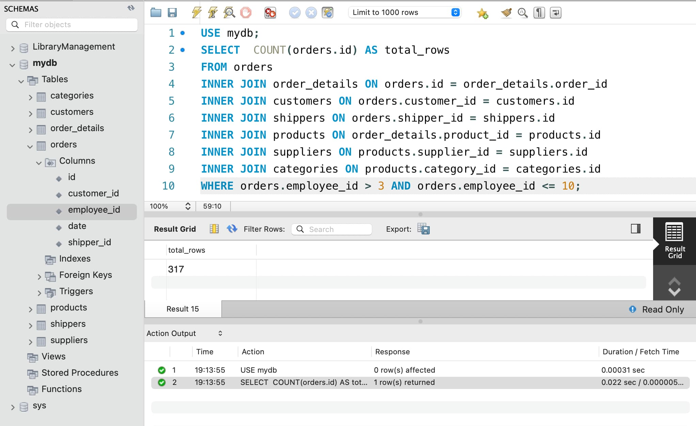

</details>
<br/>

**#4.4**

```
SELECT categories.name AS category_name,
       COUNT(orders.id) AS total_rows,
       AVG(order_details.quantity) AS avg_quantity
FROM orders
INNER JOIN order_details ON orders.id = order_details.order_id
INNER JOIN customers ON orders.customer_id = customers.id
INNER JOIN shippers ON orders.shipper_id = shippers.id
INNER JOIN products ON order_details.product_id = products.id
INNER JOIN suppliers ON products.supplier_id = suppliers.id
INNER JOIN categories ON products.category_id = categories.id
WHERE orders.employee_id > 3 AND orders.employee_id <= 10
GROUP BY categories.name;
```

<details>
  <summary>Screenshot</summary>

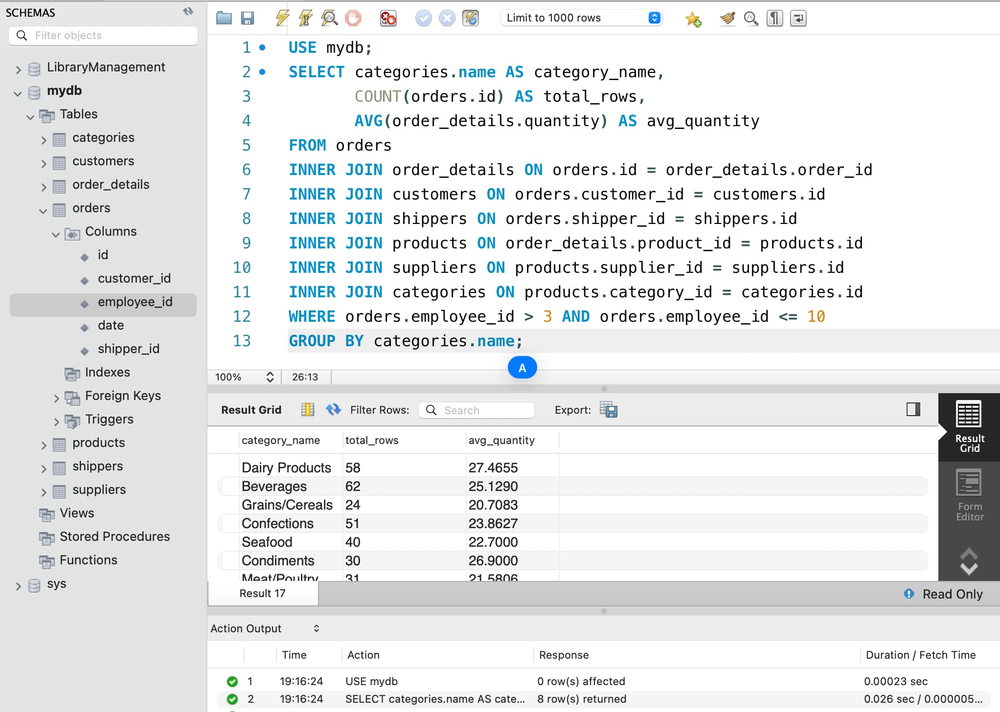

</details>
<br/>

**#4.5**

```
SELECT categories.name AS category_name,
       COUNT(orders.id) AS total_rows,
       AVG(order_details.quantity) AS avg_quantity
FROM orders
INNER JOIN order_details ON orders.id = order_details.order_id
INNER JOIN customers ON orders.customer_id = customers.id
INNER JOIN shippers ON orders.shipper_id = shippers.id
INNER JOIN products ON order_details.product_id = products.id
INNER JOIN suppliers ON products.supplier_id = suppliers.id
INNER JOIN categories ON products.category_id = categories.id
WHERE orders.employee_id > 3 AND orders.employee_id <= 10
GROUP BY categories.name
HAVING avg_quantity > 21;
```

<details>
  <summary>Screenshot</summary>

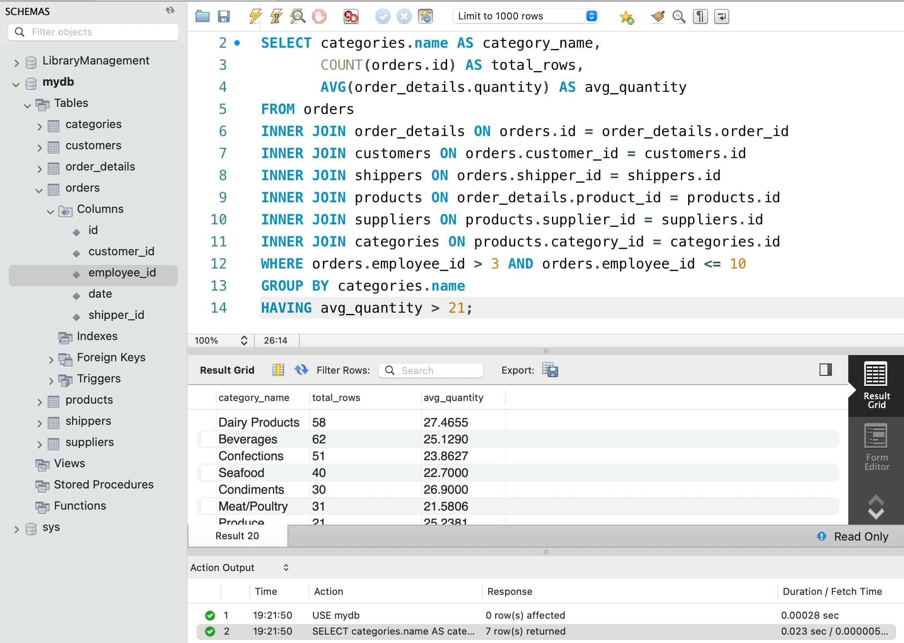

</details>
<br/>

**#4.6**

```
SELECT categories.name AS category_name,
       COUNT(orders.id) AS total_rows,
       AVG(order_details.quantity) AS avg_quantity
FROM orders
INNER JOIN order_details ON orders.id = order_details.order_id
INNER JOIN customers ON orders.customer_id = customers.id
INNER JOIN shippers ON orders.shipper_id = shippers.id
INNER JOIN products ON order_details.product_id = products.id
INNER JOIN suppliers ON products.supplier_id = suppliers.id
INNER JOIN categories ON products.category_id = categories.id
WHERE orders.employee_id > 3 AND orders.employee_id <= 10
GROUP BY categories.name
HAVING avg_quantity > 21
ORDER BY total_rows DESC;
```

<details>
  <summary>Screenshot</summary>

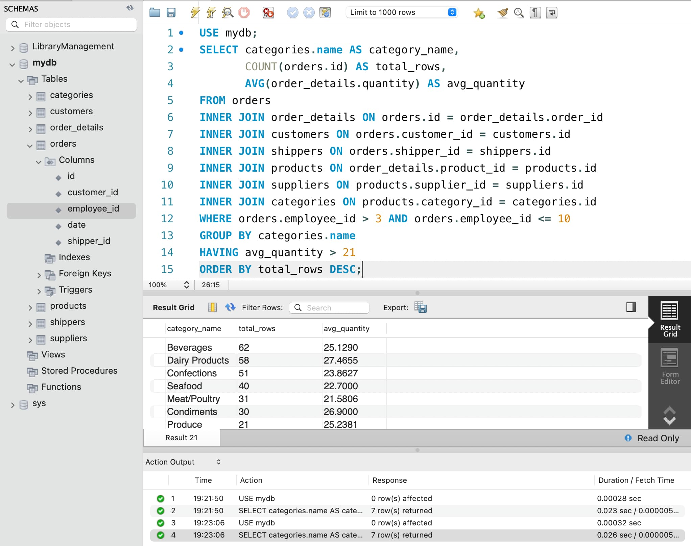

</details>
<br/>

**#4.7**

```
SELECT categories.name AS category_name,
       COUNT(orders.id) AS total_rows,
       AVG(order_details.quantity) AS avg_quantity
FROM orders
INNER JOIN order_details ON orders.id = order_details.order_id
INNER JOIN customers ON orders.customer_id = customers.id
INNER JOIN shippers ON orders.shipper_id = shippers.id
INNER JOIN products ON order_details.product_id = products.id
INNER JOIN suppliers ON products.supplier_id = suppliers.id
INNER JOIN categories ON products.category_id = categories.id
WHERE orders.employee_id > 3 AND orders.employee_id <= 10
GROUP BY categories.name
HAVING avg_quantity > 21
ORDER BY total_rows DESC
LIMIT 4 OFFSET 1;
```

<details>
  <summary>Screenshot</summary>

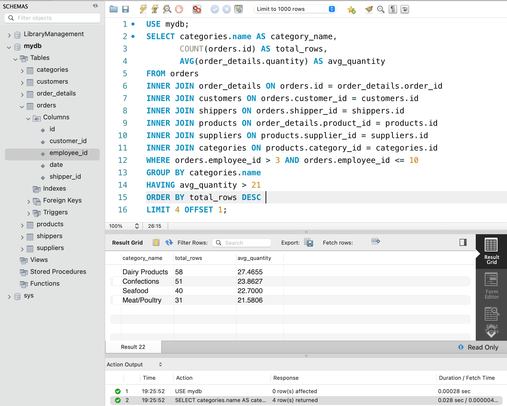

</details>
<br/>
